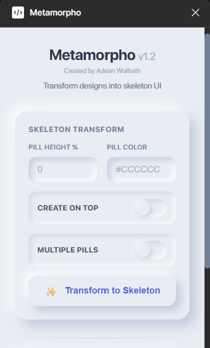
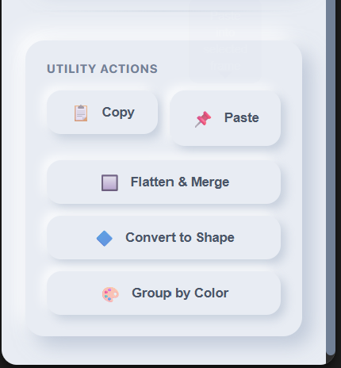

# Metamorpho - Skeleton UI Generator

Transform your Figma designs into skeleton UI with one click!

## Screenshots





## Features

- **Text to Pills**: Converts all text elements into rounded skeleton pills
- **Frames to Shapes**: Transforms frames with fills/strokes into skeleton shapes
- **One Click**: Select elements and click transform
- **Recursive**: Processes nested elements automatically

## Installation

### Option 1: Development Mode (Recommended for testing)

1. Open Figma Desktop App
2. Go to `Plugins` → `Development` → `Import plugin from manifest...`
3. Select the `manifest.json` file from this folder
4. The plugin will appear in `Plugins` → `Development` → `Metamorpho`

### Option 2: Build and Install

1. Install dependencies:
   ```bash
   npm install
   ```

2. Compile TypeScript:
   ```bash
   npm run build
   ```

3. Import in Figma (same as Option 1)

## Usage

1. Select elements in Figma (text, frames, groups, etc.)
2. Run the plugin: `Plugins` → `Metamorpho`
3. Click "Transform to Skeleton" button
4. ✨ All selected elements transform into skeleton UI!

## What Gets Transformed

- **Text nodes** → Rounded pills (gray rectangles with pill shape)
- **Frames with fills/strokes** → Gray skeleton shapes
- **Nested elements** → Recursively processed

## Development

Watch mode for development:
```bash
npm run watch
```

Then use `Plugins` → `Development` → `Metamorpho` and it will auto-reload on changes.

## Tips

- Works on multiple selections
- Preserves element positions and dimensions
- Great for creating loading states
- Perfect for mockups and prototypes

---

Made with ❤️ for the Figma community
